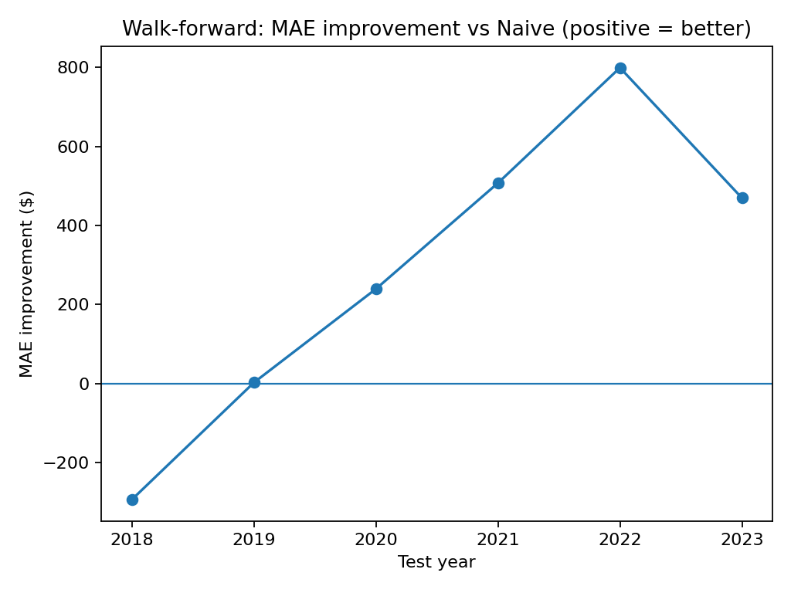
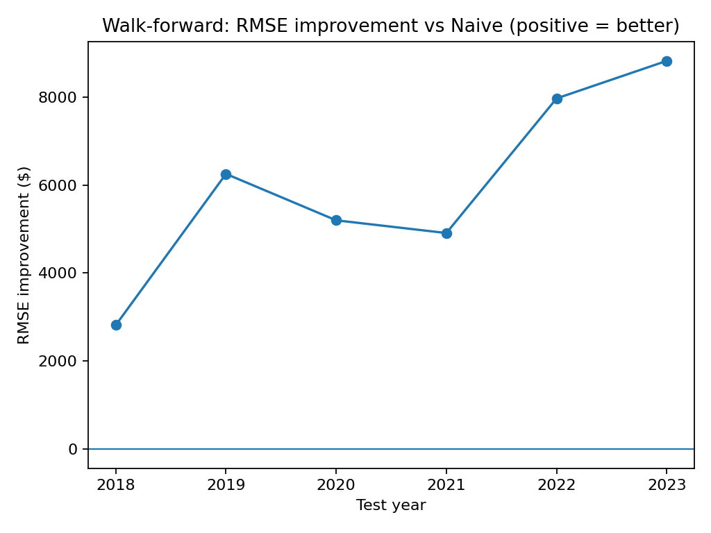

# House Price Forecasting (HouseTS) — Walk-forward Delta Model

This project builds a time-series forecasting baseline for **monthly ZIP-code house prices** using the **HouseTS (2012–2023)** dataset.
Goal: predict next month price per ZIP code and evaluate against a strong baseline.

## Dataset
- Source: HouseTS (Kaggle)
- Granularity: ZIP code × month
- Target: `median_sale_price` (USD)

## Approach (high level)
- **Naive baseline:** predict next month = last month (`lag_1`)
- **Delta model:** predict the **change** in price (delta), then reconstruct:
  - `pred_price = lag_1 + pred_delta`
- Model: **XGBoost** with early stopping
- Validation: **walk-forward evaluation** (train → validate → test year by year)

## Walk-forward results
The plots below show improvement vs the naive baseline (positive = better).

### MAE improvement (average dollar error)


### RMSE improvement (penalizes big errors)


## How to run
```bash
# 1) create venv and install
python -m venv .venv
# Windows
.venv\Scripts\activate
pip install -r requirements.txt

# 2) build dataset + features
python src/make_dataset.py
python src/features/08_build_features_v2.py
python src/features/09_build_features_delta.py

# 3) train and evaluate
python src/models/09_train_xgb_delta.py
python src/models/10_walk_forward_delta.py
